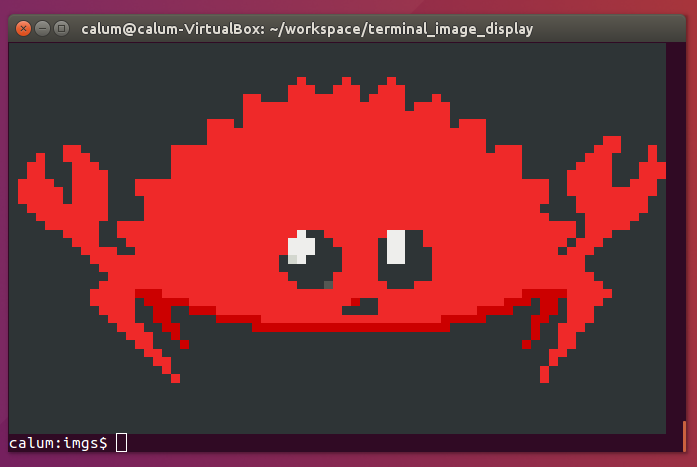
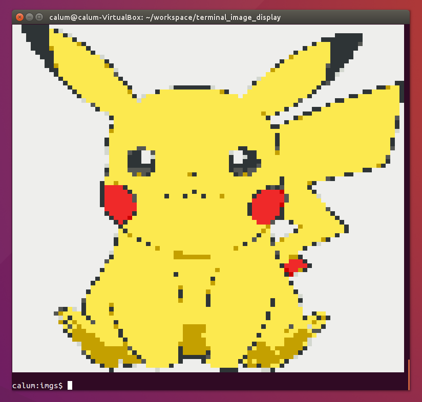

# Termage
View images in your terminal! 🖼️🖥️

## Install

You can install using [Cargo](https://crates.io/)
```
cargo install termage
```

or you can clone the repo and build the binary
```
git clone https://github.com/calum/terminal_image_display
cd terminal_image_display
cargo run -- --image ferris.png
```

## Usage
```
$ termage --help

Termage 0.1
Calum
Display any image in the terminal with Termage!

USAGE:
    termage --image <FILE>

FLAGS:
    -h, --help       Prints help information
    -V, --version    Prints version information

OPTIONS:
    -i, --image <FILE>    Input image filepath
```

## Example output
```
termage -i ferris.png
```


```
termage -i pika.png
```

